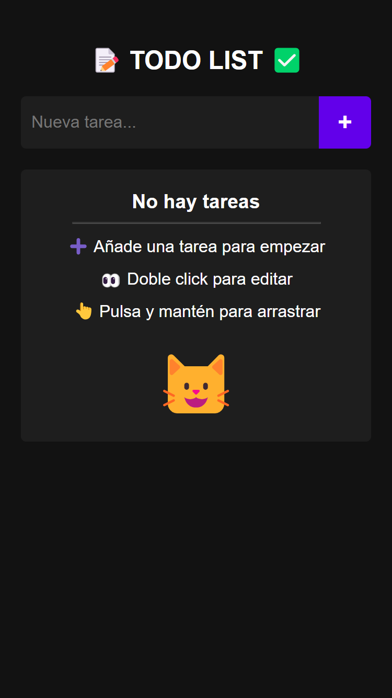
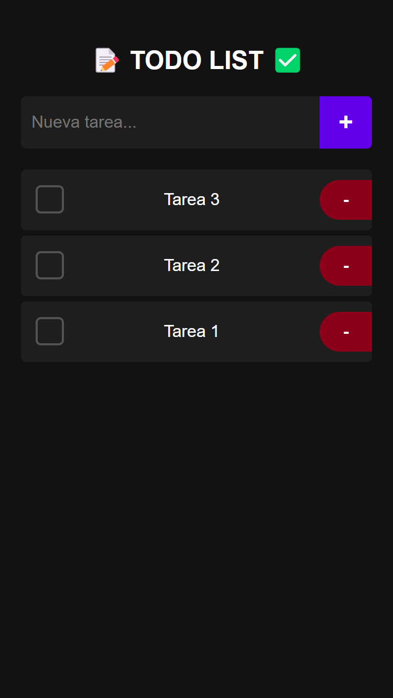

# ToDo List App

A simple, elegant, and responsive ToDo List web application built with HTML, CSS, and JavaScript.
<br>
This is a simple exercise to learn how to make a ToDo List using common web technologies.
<br>
No Frameworks / No Libraries.
<br>
Change it and adapt it to your needs.
<br>
<br>
Try it:
<br>
<b>[<a href="https://www.viseni.com/todo/" target="_blank">https://www.viseni.com/todo/</a>](https://www.viseni.com/todo/)</b>

<div style="display: flex; justify-content: space-between; width: 100%;">
  
  
</div>

## Features

- Add new tasks
- Mark tasks as completed
- Edit existing tasks
- Delete tasks (Double click on the task)
- Drag and drop to reorder tasks
- Responsive design for mobile and desktop
- Local storage to persist tasks
- Empty state message
- Animations for better user experience

## Technologies Used

- HTML5
- CSS3
- JavaScript (ES6+)

## File Structure

- `index.html`: The main HTML file
- `styles.css`: Contains all the styling for the app
- `app.js`: The JavaScript file with all the app logic

## How to Use

1. Clone the repository:
   ```
   git clone https://github.com/yourusername/todo-list-app.git
   ```

2. Open `index.html` in your web browser.

3. Start adding, editing, and managing your tasks!

## Key Features Explained

### Adding Tasks
Users can add new tasks by typing in the input field and clicking the "+" button or pressing Enter.

### Completing Tasks
Tasks can be marked as completed by clicking the checkbox next to each task.

### Editing Tasks
Double-tap or double-click on a task to edit its content.

### Deleting Tasks
Click the "-" button next to a task to delete it. A confirmation dialog will appear before deletion.

### Drag and Drop
Long-press (on mobile) or click and drag (on desktop) to reorder tasks.

### Local Storage
Tasks are automatically saved to the browser's local storage, ensuring persistence across sessions.

## Customization

You can easily customize the app's appearance by modifying the CSS variables in the `:root` selector in `styles.css`:

